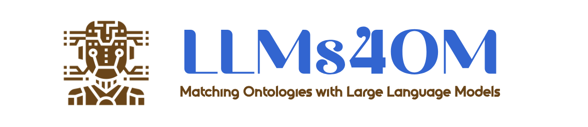
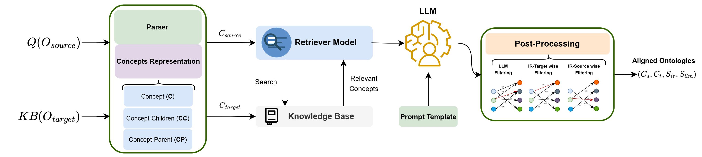

<div align="center">
 
</div>

<div align="center">


[](https://github.com/pre-commit/pre-commit)
[](https://github.com/psf/black)
[](https://pycqa.github.io/isort/)
[](https://opensource.org/licenses/MIT)
</div>

The supplementary material for detailed results of retriever and LLM modules is available here for download: [](docs/LLMs4OM_Supplementary_Material.pdf)

## What is the LLMs4OM?

The LLMs4OM framework is a novel approach for effective Ontology Matching (OM) using LLMs. This framework utilizes two modules for retrieval and matching, respectively, enhanced by zero-shot prompting across three ontology representations: concept, concept-parent, and concept-children.  It is capable of comprehensive evaluations using 20 OM datasets (but not limited to) from various domains. The LLMs4OM framework, can match and even surpass the performance of traditional OM systems, particularly in complex matching scenarios.

The following diagram represent the LLMs4OM framework.
<div align="center">
 
</div>

The LLMs4OM framework offers a retrieval augmented generation (RAG) approach within LLMs for OM. LLMs4OM uses $O_{source}$ as query $Q(O_{source})$ to retrieve possible matches for for any $C_s \in C_{source}$ from $C_{target} \in O_{target}$. Where, $C_{target}$ is stored in the knowledge base $KB(O_{target})$. Later, $C_{s}$ and obtained $C_t \in C_{target}$ are used to query the LLM to check whether the $(C_s, C_t)$ pair is a match. As shown in above diagram, the framework comprises four main steps: 1) Concept representation, 2) Retriever model, 3) LLM, and 4) Post-processing.

## Installation

You can also install and use the LLMs4OM using the following commands.
```
git clone https://github.com/XXX/LLMs4OM.git
cd LLMs4OM

pip install -r requirements.txt
mv .env-example .env
```
Next, update your tokens in `.env` or if you don't want to use `LLaMA-2` or `GPT-3.5` LLMs just put dummy tokens there.
Once you installed the requirements and prepared the `.env` file, you can move forward with experimentation.

## Quick Tour

A **RAG** specific quick tour with `Mistral-7B` and `BERTRetriever` using `C` representation.
```python
from ontomap.ontology import MouseHumanOMDataset
from ontomap.base import BaseConfig
from ontomap.evaluation.evaluator import evaluator
from ontomap.encoder import IRILabelInRAGEncoder
from ontomap.ontology_matchers import MistralLLMBertRAG
from ontomap.postprocess import process

# Setting configurations for experimenting 'rag' on GPU with batch size of 16
config = BaseConfig(approach='rag').get_args(device='cuda', batch_size=16)
# set dataset directory
config.root_dir = "datasets"
# parse task source, target, and reference ontology
ontology = MouseHumanOMDataset().collect(root_dir=config.root_dir)

# init encoder (concept-representation)
encoded_inputs = IRILabelInRAGEncoder()(ontology)

# init Mistral-7B + BERT
model = MistralLLMBertRAG(config.MistralBertRAG)
# generate results
predicts = model.generate(input_data=encoded_inputs)

# post-processing
predicts, _ = process.postprocess_hybrid(predicts=predicts,
                                         llm_confidence_th=0.7,
                                         ir_score_threshold=0.9)
# evaluation
results = evaluator(track='anatomy',
                    predicts=predicts,
                    references=ontology["reference"])
print(results)
```


A **Retrieval** specific quick tour with `BERTRetriever` using `C` representation.
```python
from ontomap.ontology import MouseHumanOMDataset
from ontomap.base import BaseConfig
from ontomap.evaluation.evaluator import evaluator
from ontomap.encoder.lightweight import IRILabelInLightweightEncoder
from ontomap.ontology_matchers.retrieval.models import BERTRetrieval
from ontomap.postprocess import process

# Setting configurations for experimenting 'retrieval' on CPU
config = BaseConfig(approach='retrieval').get_args(device='cpu')
# set dataset directory
config.root_dir = "datasets"
# parse task source, target, and reference ontology
ontology = MouseHumanOMDataset().collect(root_dir=config.root_dir)

# init encoder (concept-representation)
encoded_inputs = IRILabelInLightweightEncoder()(ontology)

# init BERTRetrieval
model = BERTRetrieval(config.BERTRetrieval)
# generate results
predicts = model.generate(input_data=encoded_inputs)

# post-processing
predicts = process.eval_preprocess_ir_outputs(predicts=predicts)

# evaluation
results = evaluator(track='anatomy',
                    predicts=predicts,
                    references=ontology["reference"])
print(results)
```

### Retrieval Models Imports
```python
from ontomap.ontology_matchers.rag.models import ChatGPTOpenAIAdaRAG
from ontomap.ontology_matchers.rag.models import FalconLLMAdaRAG, FalconLLMBertRAG
from ontomap.ontology_matchers.rag.models import LLaMA7BLLMAdaRAG, LLaMA7BLLMBertRAG
from ontomap.ontology_matchers.rag.models import MistralLLMAdaRAG, MistralLLMBertRAG
from ontomap.ontology_matchers.rag.models import MPTLLMAdaRAG, MPTLLMBertRAG
from ontomap.ontology_matchers.rag.models import VicunaLLMAdaRAG, VicunaLLMBertRAG
from ontomap.ontology_matchers.rag.models import MambaLLMAdaRAG, MambaLLMBertRAG
```
### LLMs Models Imports
```python
from ontomap.ontology_matchers.retrieval.models import AdaRetrieval
from ontomap.ontology_matchers.retrieval.models import BERTRetrieval
from ontomap.ontology_matchers.retrieval.models import SpecterBERTRetrieval
from ontomap.ontology_matchers.retrieval.models import TFIDFRetrieval
```

### Track Tasks Imports - `Parser`
```python
# CommonKG track
from ontomap.ontology.commonkg import NellDbpediaOMDataset, YagoWikidataOMDataset
# MSE track
from ontomap.ontology.mse import MaterialInformationEMMOOMDataset, MaterialInformationMatOntoMDataset
# Phenotype track
from ontomap.ontology.phenotype import DoidOrdoOMDataset, HpMpOMDataset
# Anatomy
from ontomap.ontology.anatomy import MouseHumanOMDataset
# Biodiv
from ontomap.ontology.biodiv import EnvoSweetOMDataset, FishZooplanktonOMDataset,\
                                    MacroalgaeMacrozoobenthosOMDataset, TaxrefldBacteriaNcbitaxonBacteriaOMDataset, \
                                    TaxrefldChromistaNcbitaxonChromistaOMDataset, TaxrefldFungiNcbitaxonFungiOMDataset,\
                                    TaxrefldPlantaeNcbitaxonPlantaeOMDataset, TaxrefldProtozoaNcbitaxonProtozoaOMDataset
# Bio-ML
from ontomap.ontology.bioml import NCITDOIDDiseaseOMDataset, OMIMORDODiseaseOMDataset, \
                                   SNOMEDFMABodyOMDataset, SNOMEDNCITNeoplasOMDataset, SNOMEDNCITPharmOMDataset
```

### Concept-Representations - `C`, `CC`, and `CP`
```python
# Retriever models concept representations
from ontomap.encoder.lightweight import IRILabelInLightweightEncoder              # C
from ontomap.encoder.lightweight import IRILabelChildrensInLightweightEncoder     # CC
from ontomap.encoder.lightweight import IRILabelParentsInLightweightEncoder       # CP

# RAG models concept representations
from ontomap.encoder.rag import IRILabelInRAGEncoder              # C
from ontomap.encoder.rag import IRILabelChildrensInRAGEncoder     # CC
from ontomap.encoder.rag import IRILabelParentsInRAGEncoder       # CP
```

### OMPipeline usage
To use LLMs4OM pipleine follow the followings. It will run one model at a time over 20 OM tasks.

```python
from ontomap import OMPipelines

# setting hyperparameters
approach="rag"
encoder="rag"
use_all_encoders=False
approach_encoders_to_consider=['label'] # C representation
use_all_models=False
load_from_json=False
device="cuda"
do_evaluation=False
batch_size=16
llm_confidence_th=0.7
ir_score_threshold=0.9
model="['MistralBertRAG']"
outputs='output-rag-mistral'

# arguments
args = {
    'approach': '$approach',
    'encoder': '$encoder',
    'use-all-encoders': use_all_encoders,
    'approach-encoders-to-consider': approach_encoders_to_consider,
    'use-all-models': use_all_models,
    'models-to-consider': model,
    'load-from-json': load_from_json,
    'device': device,
    'do-evaluation': do_evaluation,
    'outputs-dir': outputs,
    'batch-size': batch_size,
    'llm_confidence_th': llm_confidence_th,
    'ir_score_threshold': ir_score_threshold
}

# Running OMPipelines
runner = OMPipelines(**args)

runner()
```

## Citation
If you found this project useful in your work or research please cite it by using this BibTeX entry:
```bibtex
@misc{llms4om2024,
  title =        {LLMs4OM: Matching Ontologies with Large Language Models},
  year =         {2024}
}
```
